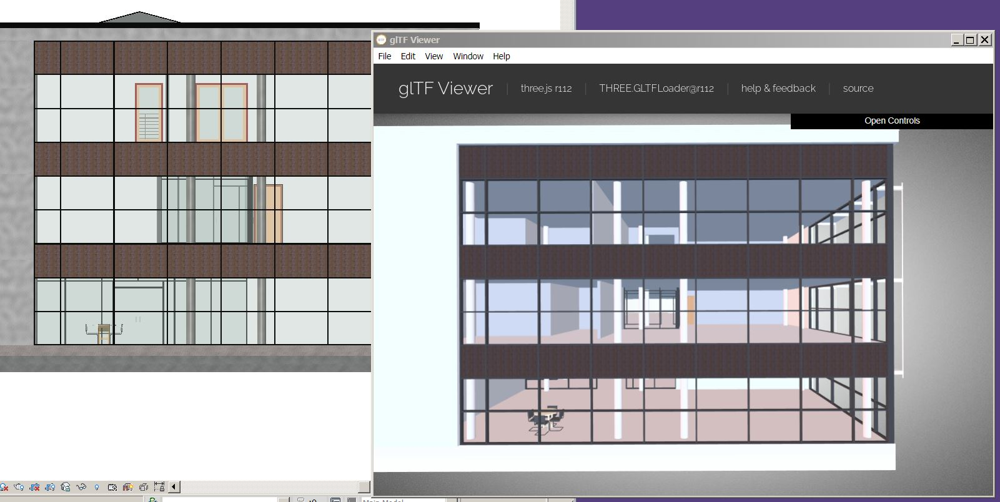

# Revit2Gltf
Open source converter and plugin for Revit files to gLTF. Created by [Cityzenith](http://www.cityzenith.com) for seeding digital twins.

## Why gLTF?
gLTF is a portable 3d object schema produced by Khronos Group which combines high performance, portability and human-readability.
Its accepted by many softwares and can be used in JS 3d viewers such as Three and Babylon.

gLTFs consist of two key parts:

- myfile.gltf    <- Contains the model's heirarchy and metadata in JSON.

- myfile.bin     <- A binary of the model's geometry ("buffer"), intended to be efficiently compressed for portability and performance. This is explicitly referred to in the .gltf file, so don't change the name of this file without changing the reference in the .gltf file!

and...

- everythingelse <- Your textures and linked files specified within the .gltf

You can add further compression with processes such as [DRACO](https://google.github.io/draco/)

## How to use

### Exporting a gLTF
- Clone the repository
- Restore NuGet packages
- Build the solution 
- Hit the Export To Gltf button in the Cityzenith tab and you'll have your GLTF.
- Enjoy it!

### Adding gLTF export to your plugin
- Include the Revit2Gltf library in your solution (NuGet package coming soon!)
- Use the ExportToGltf method to convert your document to a gltf model.
- Use Assimp.Net's library to access and modify the contents of the gltf model while loaded into memory.

## Caveats
- Tested only in Revit 2016 (Licenses are expensive!) but should work 99% perfectly on other platforms. Compiler conditionals are set up for breaking API changes such as in Revit 2020

Maintained by Leland Jobson (gh: lelandjobson)
